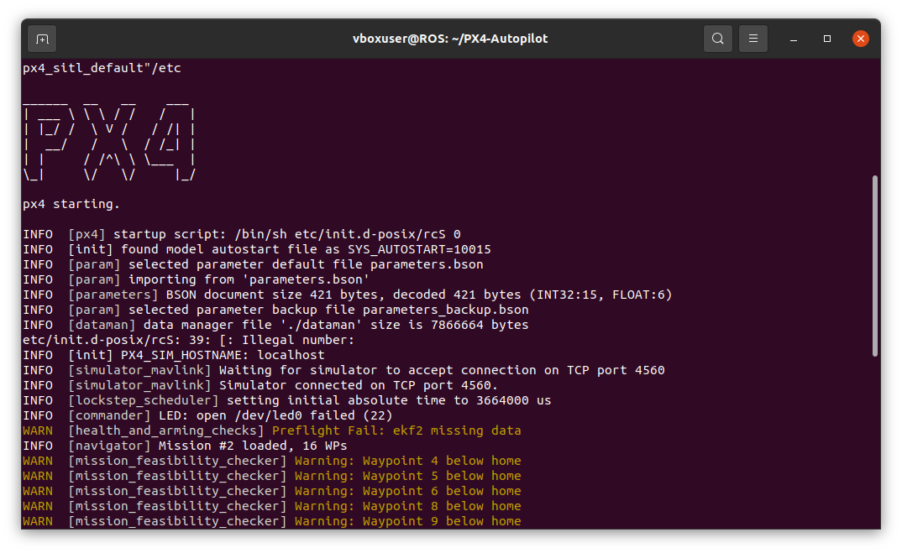
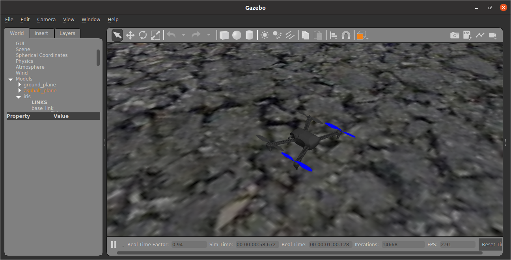
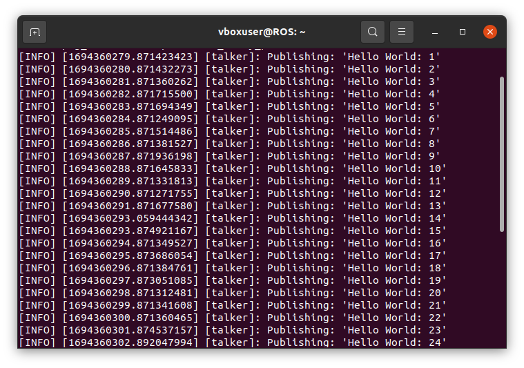
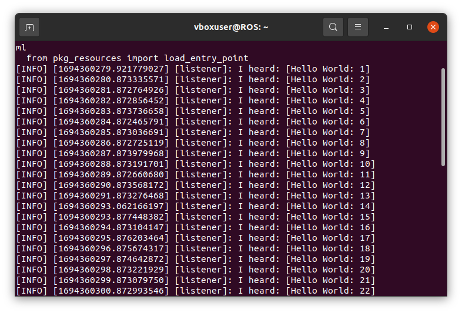
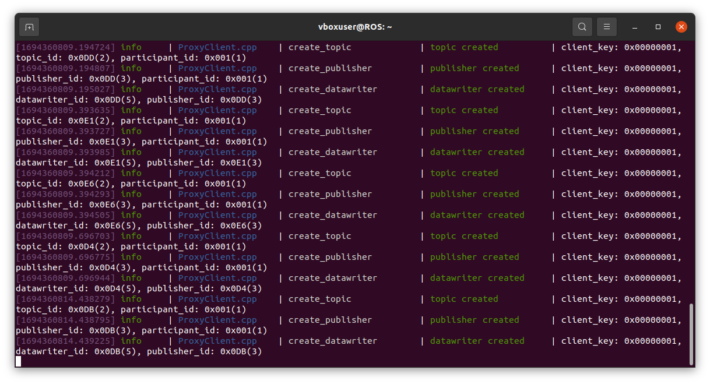
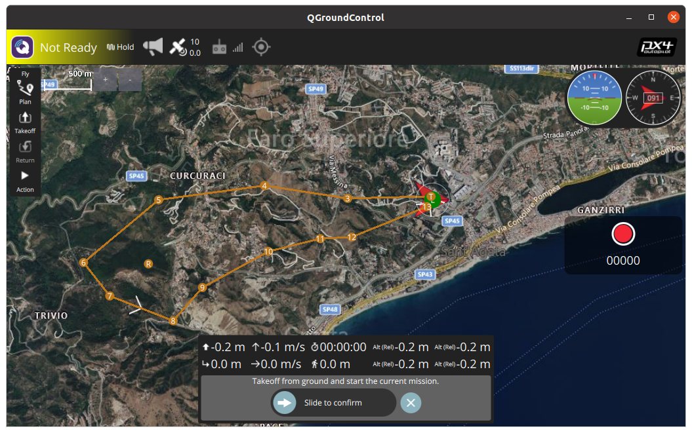
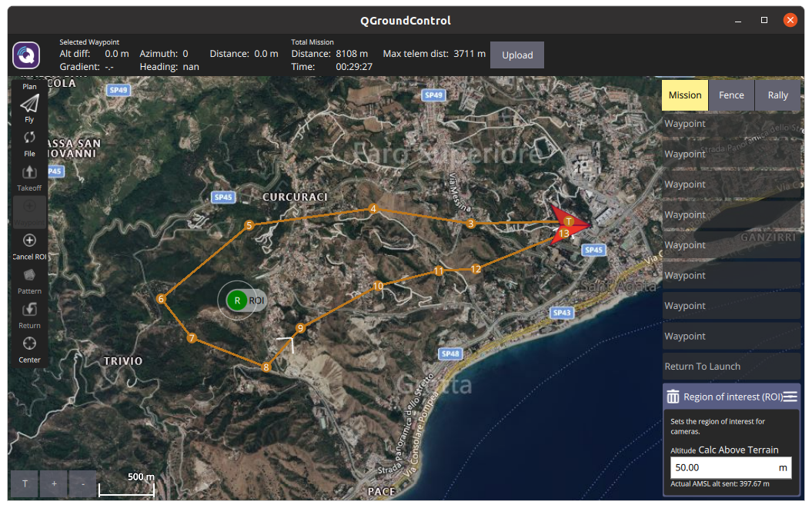

# Industrial Internet of Things Project
The goal of this project is to create a simulation of a drone that inspects a portion of a predefined territory to verify through cameras any plant diseases in the monitored area.  
This project is divided into two parts, this repo focuses on the simulation of the drone, including a sort of digital twin approach, in which data from all sensors and GPS are acquired using ROS 2 and stored into two .csv files with the purpose to be further processed.
The cameras and the identification of the plants' disease are managed in a different project.

The project uses different tools to achieve its goal:
* PX4-Autopilot;
* Ubuntu 20.04 on VM;
* ROS 2 Foxy;
* uXRCE-DDS;

In this repo will be described the installation of each tool and the tutorial to get the desidered results.

## Installation

This installation tutorial is meant to be for Ubuntu 20.04 using ROS2 Foxy and the latest version of PX4 at the moment of writing this (05/09/2023).

### PX4 

Clone the PX4 source code from the [repository](https://github.com/PX4/PX4-Autopilot). 

```bash
git clone https://github.com/PX4/PX4-Autopilot.git --recursive
```
#### First build 
To validate the system before proceeding with the installation of ROS2 and other components we can build the SITL (Software In The Loop) with the default drone. 

```bash
cd PX4-Autopilot
make px4_sitl gazebo-classic
```





### ROS2 Foxy

#### Set UTF-8 locale

Before installing ROS2 it should be ensured that the locale supports _UTF-8_

```bash
locale
```
if not, it should be updated as follows:


```bash
sudo apt update && sudo apt install locales
sudo locale-gen en_US en_US.UTF-8
sudo update-locale LC_ALL=en_US.UTF-8 LANG=en_US.UTF-8
export LANG=en_US.UTF-8
```

A different language can be used, as long as it supports _UTF-8_.

#### Setup sources

Once the locale has been set, it is possible to setup the sources in order to install ROS 2.

```bash
sudo apt install software-properties-common
sudo add-apt-repository universe
sudo apt update && sudo apt install curl -y
sudo curl -sSL https://raw.githubusercontent.com/ros/rosdistro/master/ros.key -o /usr/share/keyrings/ros-archive-keyring.gpg
echo "deb [arch=$(dpkg --print-architecture) signed-by=/usr/share/keyrings/ros-archive-keyring.gpg] http://packages.ros.org/ros2/ubuntu $(. /etc/os-release && echo $UBUNTU_CODENAME) main" | sudo tee /etc/apt/sources.list.d/ros2.list > /dev/null
```

#### Install ROS 2 Foxy

Before installing ROS 2 packages it is better to update apt caches:

```bash
sudo apt update
sudo apt upgrade
```
Once the caches has been updated it is possible to install all the ROS 2 packages, the recommended install is the desktop one:

```bash
sudo apt install ros-foxy-desktop python3-argcomplete
```

In order to set up the environment it is needed to source the setup file as follows:

```bash
source /opt/ros/foxy/setup.bash
```

Some python dependencies for ROS 2 must be also installed:  

```bash
pip install --user -U empy pyros-genmsg setuptools
```

#### First build

To check if the installation is has ended successfully it is possible to run a simple talker-listener example, run the following two demo examples in two different terminal:

```bash
ros2 run demo_nodes_cpp talker
```



```bash
ros2 run demo_nodes_py listener
```


### Setup ROS 2 and PX4 interactions

In order to let ROS 2 communicate with PX4 it is being used the [uXRCE-DDS Agent](https://docs.px4.io/main/en/modules/modules_system.html#uxrce-dds-client), the following instructions are used to build the standalone agent from source and connect the client to the PX4 simulator.

```bash
git clone https://github.com/eProsima/Micro-XRCE-DDS-Agent.git
cd Micro-XRCE-DDS-Agent
mkdir build
cd build
cmake ..
make
sudo make install
sudo ldconfig /usr/local/lib/
```

The agent should be started with the following command:

```bash
MicroXRCEAgent udp4 -p 8888
```
 

## Usage      

Once PX4, ROS 2 and uXRCE-DDS have been correctly set up it is possible to start the demo. 

### PX4 Simulation
In order to initialize the simulation to the right position is necessary to set Home latitude, longitude and altitude of the drone.

```bash
cd PX4-Autopilot
export PX4_HOME_LAT=38.25905277824533
export PX4_HOME_LON=15.595626222658453
```
This will initialize the position to the Department of Engineering of the University of Messina.


It is possible to start the simulation for PX4 with gazebo using the following command:

```bash
HEADLESS=1 make px4_sitl gazebo-classic
```

The _HEADLESS=1_ option allows to run the simulation without the GUI, with the purpose to not require too many computational resources, since the simulation of the drone will be visualized from QGroundControl.


### QGroundControl

QGroundControl is used to plan the simulated mission that the drone should do.



From the plan tab it is possible to plan the mission adding waypoints to realize the path the drone should follow during its mission, as can be seen below.
The Region Of Interest (ROI) waypoint is used to add the region that should be inspected from the drone during its mission. 
The final [missionplan](mission_Messina_Final.plan) is shared in order to have the same results.



### ROS2 Interaction with PX4

To achieve the goal of making a sort of Digital Twin of the simulated drone it is necessary to find the topic to which subscribe in order to acquire the desidered informations.  
In the [dds_topic.yaml](https://github.com/PX4/PX4-Autopilot/blob/main/src/modules/uxrce_dds_client/dds_topics.yaml) in the [PX4-Autopilot](https://github.com/PX4/PX4-Autopilot) repository are defined all the possible topics to which is possible to subscribe.  
For the proposed approach the topic selected are SensorCombined and SensorGPS, these two topic are handled by two different nodes, the first one will acquire all the data from the sensors in the SI, these data will be then displayed into the terminal in run-time and stored to a .csv file in order to be further processed if needed; the latter node is the SensorGPS, which handles messages about the GPS Position of the drone, also this time data will be displayed into the terminal and saved to a .csv file to be further processed.  
All other uORB topics can be checked into the [uORB Message Reference](https://docs.px4.io/main/en/msg_docs/)

In order to acquire messages from the PX4 simulation a subscriber node is required, for this reason in the [src](src) are present two directories containing the two types of messages and the code for the subscribers nodes respectively.


## Analysis of the code

### Messages definition 
In the [Messages](src/px4_msgs) directory the two type of messages are defined, the directory containes also the [CMakeLists](src/px4_msgs/CMakeLists.txt) to build the package.

### Communication packages
The [Code](src/px4_ros) directory has inside the [code](src/px4_ros/src/scripts) folder the two nodes definition in cpp, one for all the sensors data and one for the GPS position.

### Building of the packages

To build the packages download the [src](src) folder and use colcon to build from the main project directory

```bash
sudo apt install python3-colcon-common-extensions
colcon build
```

After the build it will be possible to source the local setup and then run the launch files for each package.

```bash
source install/local_setup.bash
```

Launch command for all the sensors data:

```bash
ros2 launch px4_ros sensor_combined_listener.launch.py
```

Launch command for the GPS position data:

```bash
ros2 launch px4_ros gps_data_listener.launch.py
```


## Examples


<iframe
  src="https://www.youtube.com/watch?v=vjxWFC-qre8"
  style="width:100%; height:300px;"
></iframe>

[](https://www.youtube.com/watch?v=vjxWFC-qre8)